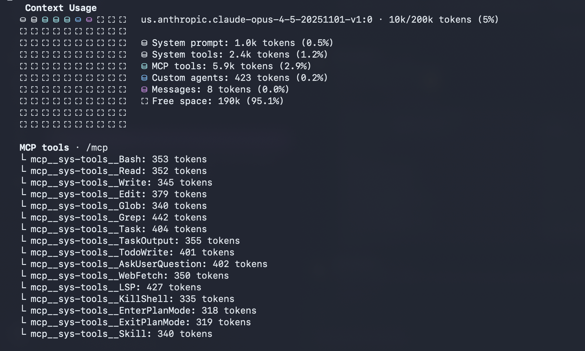

# sys-tools-mcp

A Ruby MCP (Model Context Protocol) server providing Claude Code-style tools for AI assistants. Includes 16 tools for file operations, shell commands, code search, LSP integration, and subagent orchestration.

## Motivation

Opus 4.5 is a capable model that doesn't require verbose system prompts and handholding unlike Sonnet. The default Claude Code system prompts are inefficient, consuming ~20k tokens of initial context.

This matters because models like Opus noticeably degrade in intelligence when context window reaches 60-70% utilization. Saving 10k+ tokens significantly extends useful conversation length.

**This project achieves ~10k token initial context** by:
- Replacing bloated built-in tool definitions with minimal MCP equivalents
- Using `--disallowed-tools` to disable Claude Code's verbose tool prompts
- Allowing custom system prompts via `--system-prompt`



An alternative approach uses [tweakcc](https://github.com/nicobailon/tweakcc) to patch tool prompts directly in the CLI binary. Ready to test [better prompts](https://github.com/restot/claude-code-better-system-prompts) This MCP approach achieves similar results without binary modification.

## Requirements

- Ruby 3.x
- [mise](https://mise.jdx.dev/) (optional, for version management)
- AWS credentials configured (for subagent tasks via Bedrock)
- ripgrep (`rg`) for grep operations

### Ruby Gems

```bash
gem install anthropic connection_pool aws-sdk-bedrockruntime
```

## Configuration

Copy the example config and update the path:

```bash
cp mcp-config.json.example mcp-config.json
```

Edit `mcp-config.json` to point to your installation:

```json
{
  "mcpServers": {
    "sys-tools": {
      "command": "mise",
      "args": ["exec", "ruby", "--", "ruby", "/path/to/sys-tools-mcp.rb"]
    }
  }
}
```

### Environment Variables

| Variable | Default | Description |
|----------|---------|-------------|
| `AWS_REGION` | `us-east-1` | AWS region for Bedrock |
| `AWS_PROFILE` | `default` | AWS credentials profile |

## Tools

| Tool | Description |
|------|-------------|
| `Bash` | Execute shell commands (with timeout and background support) |
| `Read` | Read file contents with optional offset/limit |
| `Write` | Write/create files |
| `Edit` | String replacement in files |
| `Glob` | Find files by pattern |
| `Grep` | Search file contents with ripgrep |
| `Task` | Launch subagent for complex tasks (via Bedrock) |
| `TaskOutput` | Get output from background tasks |
| `TodoWrite` | Manage task list |
| `AskUserQuestion` | Interactive user input |
| `WebFetch` | Fetch URL content |
| `LSP` | Language Server Protocol operations |
| `KillShell` | Terminate background shells |
| `EnterPlanMode` | Start planning mode |
| `ExitPlanMode` | Exit planning mode |
| `Skill` | Execute slash command skills |

### LSP Support

Built-in LSP server detection for:
- Ruby (ruby-lsp)
- TypeScript/JavaScript (typescript-language-server)
- Python (pylsp)
- Go (gopls)
- Rust (rust-analyzer)

## Usage with Claude Code

Use a shell alias to run Claude Code with MCP tools replacing the built-in tools:

```bash
alias ccd-v1-sysmcp='claude --disallowed-tools "Bash,Read,Write,Edit,Glob,Grep,Task,TaskOutput,TodoWrite,LSP,KillShell" --mcp-config $MCP/mcp-config.json --system-prompt "$(cat $PROMPT/my-sys-prompt-v1.md)"'
```

This approach:
- Disables Claude Code's built-in tools via `--disallowed-tools`
- Loads the MCP server tools as replacements via `--mcp-config`
- Uses a custom system prompt via `--system-prompt`

Set up your environment variables:

```bash
export MCP=/path/to/mcp-configs
export PROMPT=/path/to/prompts
```

## Running Standalone

Run directly:

```bash
ruby sys-tools-mcp.rb
```

Or via mise:

```bash
mise exec ruby -- ruby sys-tools-mcp.rb
```

The server communicates via stdin/stdout using JSON-RPC 2.0 (MCP protocol).

## Subagent Models

The `Task` tool supports these Bedrock models:

| Model | Bedrock ID |
|-------|------------|
| `sonnet` (default) | `us.anthropic.claude-sonnet-4-20250514-v1:0` |
| `opus` | `us.anthropic.claude-opus-4-20250514-v1:0` |
| `haiku` | `us.anthropic.claude-haiku-4-20250514-v1:0` |


## License

MIT
